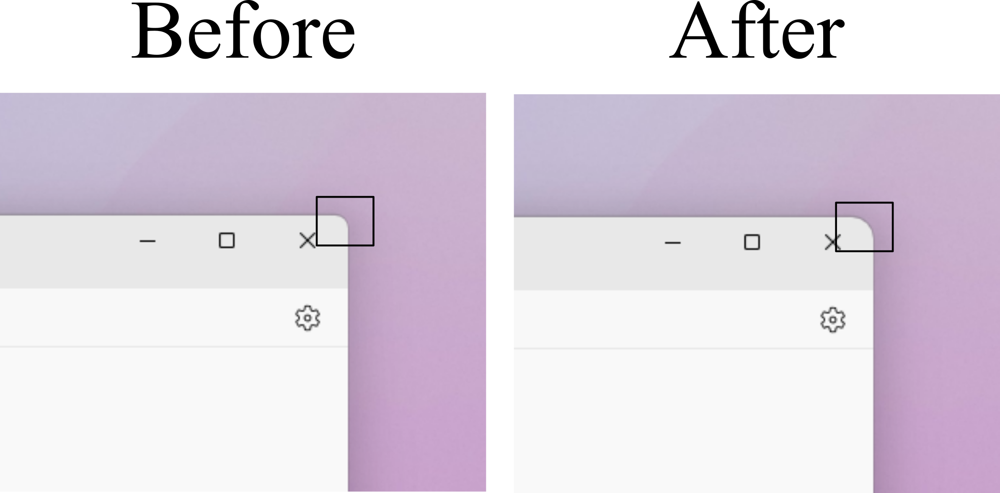

# rounded-corners-win11

Windhawk mod to customize window corner radius beyond Windows 11's default 8px limit.

## Features

- Set custom corner radius for all windows (1–60px)
- Leaves popups and flyouts unchanged (default 4px)
- DPI-aware scaling

## Requirements

- Windows 11
- [Windhawk](https://windhawk.net/) installed

## Installation

1. Open **Windhawk**
2. Click **Create new mod**
3. Delete the template code
4. Copy and paste the contents of [`windhawk-rounded-corners.wh.cpp`](windhawk-rounded-corners.wh.cpp)
5. Click **Compile mod**

## Configuration

After installing, go to the mod's **Settings** tab in Windhawk:

| Setting | Description | Default | Range |
|--------|-------------|---------|-------|
| `radius` | Corner radius in pixels | `8` | `1–60` |

## Usage

- Set `radius` to `20` for a macOS-like rounded look
- Set `radius` to `8` to match Windows 11 default
- Set `radius` to `1` for nearly square corners

